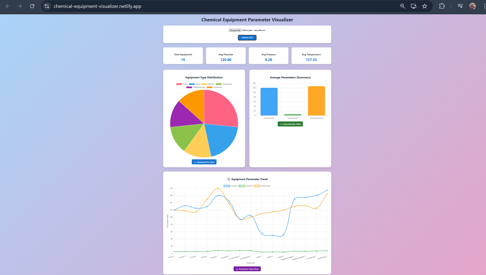
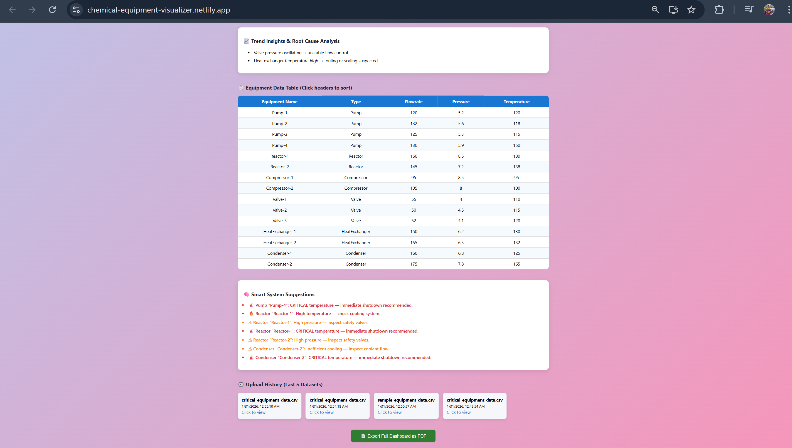
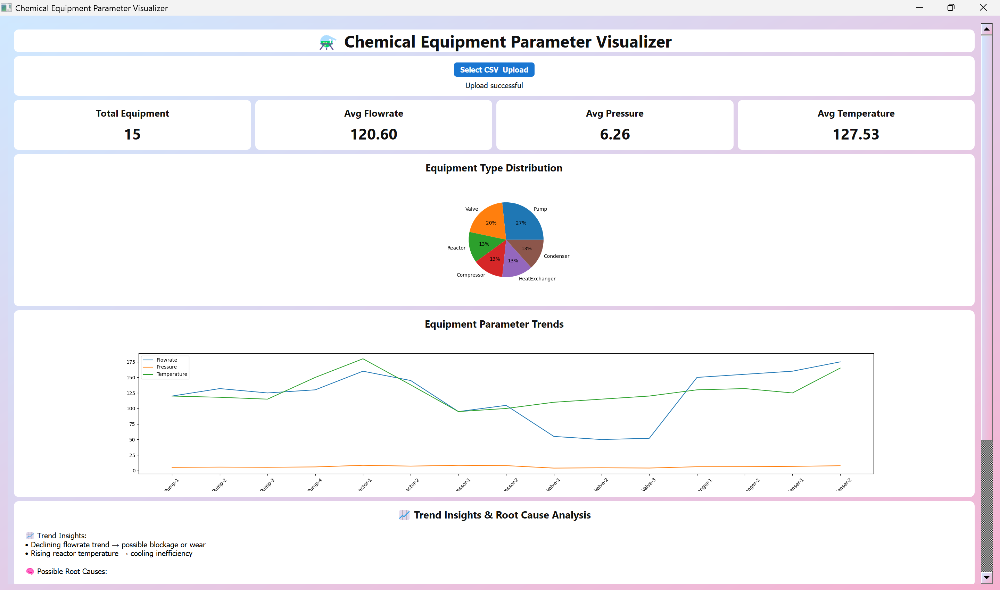

---

#  Chemical Equipment Parameter Visualizer

### Hybrid Web + Desktop Data Analytics Application

A full-stack hybrid application that allows users to upload CSV datasets of chemical equipment parameters, analyze them using a Django REST backend, and visualize insights via both **Web (React)** and **Desktop (PyQt5)** applications.

This project focuses on **data visualization, analytics, and smart system suggestions** for chemical equipment monitoring.

---

## 🚀 Features

###  Common (Web + Desktop)

* 📂 Upload CSV files of equipment data
* 📊 Automatic data analysis using Pandas
* 📈 Visual charts:

  * Equipment type distribution (Pie Chart)
  * Average parameters (Bar Chart)
* 📋 Equipment data table
* 🧠 Smart System Suggestions Engine:

  * Detects unsafe pressure
  * Detects overheating
  * Detects flow issues
* 📄 Download summary PDF report
* 🗂️ Upload history (last 5 datasets)

---

### 🌐 Web Application (React)

* 🎨 Modern gradient UI with cards
* 📊 Animated charts using Chart.js
* 📥 Export charts as images
* 🔍 Sortable equipment table
* 🧠 Color-coded smart alerts
* 📄 Download PDF report from backend

---

### 🖥️ Desktop Application (PyQt5)

* 🎯 Same layout and color theme as web app
* 📊 Matplotlib charts embedded in UI
* 📋 Equipment table view
* 🧠 Smart alerts section
* 📥 Save charts as images
* 📂 Upload CSV directly to Django API

---

## 📸 Application Screenshots

### 🌐 Web Dashboard




---

### 🖥 Desktop Application



---

## 🧰 Tech Stack

| Layer              | Technology                    |
| ------------------ | ----------------------------- |
| Frontend (Web)     | React.js, Chart.js, Axios     |
| Frontend (Desktop) | PyQt5, Matplotlib             |
| Backend            | Django, Django REST Framework |
| Data Processing    | Pandas                        |
| PDF Generation     | ReportLab                     |
| Database           | SQLite                        |
| Version Control    | Git & GitHub                  |

---

## 📁 CSV File Format (Required)

Your CSV must contain exactly these columns:

```csv
Equipment Name,Type,Flowrate,Pressure,Temperature
Pump-1,Pump,120,5.2,97
Reactor-1,Reactor,140,7.5,165
HeatExchanger-1,HeatExchanger,150,6.2,130
...
```

---

## ⚙️ Backend Setup (Django)

### 1️⃣ Create Virtual Environment

```bash
python -m venv venv
venv\Scripts\activate
```

### 2️⃣ Install Dependencies

```bash
pip install django djangorestframework pandas django-cors-headers reportlab
```

### 3️⃣ Run Migrations

```bash
python manage.py migrate
```

### 4️⃣ Start Backend Server

```bash
python manage.py runserver
```

Backend runs at:

```
http://127.0.0.1:8000/api/upload/
```

---

## 🌐 Web App Setup (React)

### 1️⃣ Go to frontend folder

```bash
cd frontend
```

### 2️⃣ Install Packages

```bash
npm install
```

### 3️⃣ Start Web App

```bash
npm start
```

Open in browser:

```
http://localhost:3000
```

---

## 🖥️ Desktop App Setup (PyQt5)

### 1️⃣ Go to desktop app folder

```bash
cd desktop-app
```

### 2️⃣ Install Dependencies

```bash
pip install pyqt5 matplotlib pandas requests
```

### 3️⃣ Run Desktop App

```bash
python main.py
```

⚠️ **Make sure Django backend is running before using desktop app.**

---

## 🧠 Smart Suggestions Engine — Rules

The system checks for:

### Pumps

* Low pressure
* Low flow rate

### Reactors

* High temperature
* High pressure

### Compressors

* Low compression

### Valves

* Pressure drop

### Heat Exchangers

* High outlet temperature

### Condensers

* Inefficient cooling

### Global Safety

* Critical temperature → emergency shutdown warning

---

## 📄 PDF Report Includes

* Total equipment count
* Average parameters
* Equipment type distribution

---

## 🎯 Project Objective

To build a **Hybrid Web + Desktop Analytics System** using:

* A single Django backend
* Multiple frontend clients
* Real-time data analysis
* Visual analytics
* Engineering-based safety insights

---

## 📌 Future Enhancements

* 🧠 ML-based anomaly detection
* 🔐 User authentication

---

## 👨‍💻 Developed By

**Raghav Khare**
VIT Bhopal University
Computer Science Engineering(AI and ML)

---


